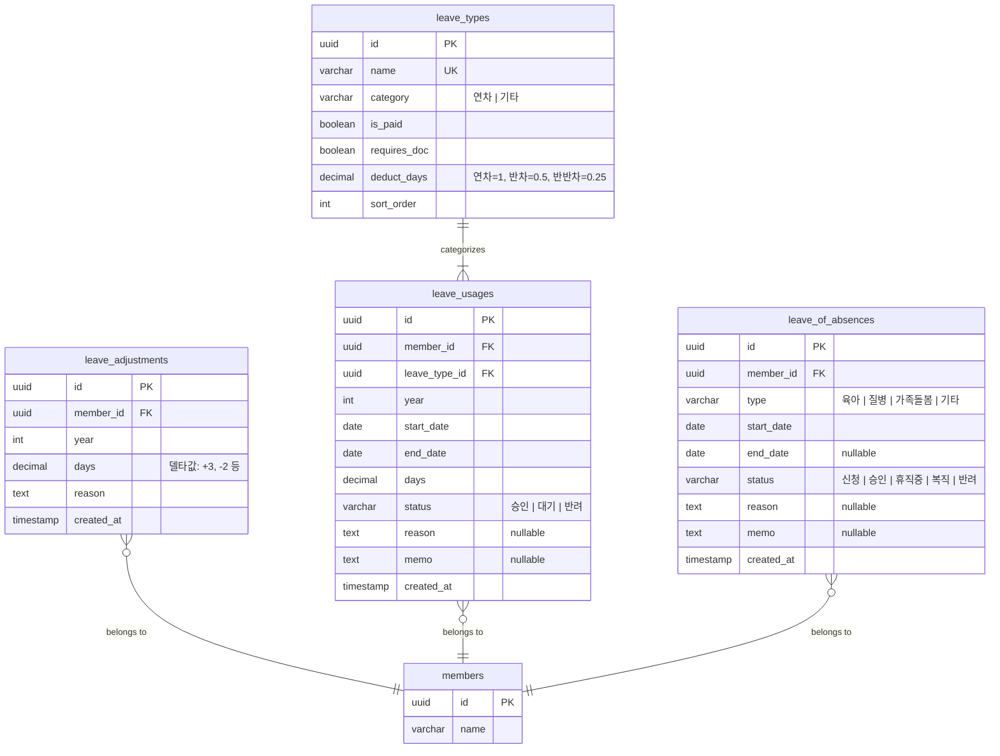

# 연차/휴가 관리

## 연차 유형 (Leave Type)

### 엔티티

- 이름 (고유): 연차, 반차, 반반차, 공가, 경조휴가 등
- 카테고리: 연차 | 기타
- 유급 여부
- 증빙서류 필수 여부
- 차감 일수: 연차=1, 반차=0.5, 반반차=0.25, 기타=0
- 정렬 순서

### 비즈니스 규칙

- 드래그 앤 드롭으로 정렬 순서를 변경할 수 있다
- 카테고리가 "연차"인 유형만 연차 일수에서 차감된다

## 연차 정책

### 연차 일수 계산

모든 연차 수치는 파생값이다. 별도 캐시 테이블 없이 매번 계산한다.

- **총 일수** = 입사일 기준 자동 계산 (근로기준법 기반)
- **조정 일수** = 조정 이력 합산 (관리자가 +/- 조정)
- **사용 일수** = 승인된 연차 사용 이력 합산
- **잔여 일수** = 총 일수 + 조정 일수 - 사용 일수

### 연차 조정

- 관리자가 특정 구성원의 연차를 +/- 조정할 수 있다
- 조정 사유를 필수로 기록한다
- 조정 이력은 누적 관리된다

## 연차 신청 (Leave Usage)

### 엔티티

- 신청자 (구성원)
- 연차 유형
- 시작일, 종료일
- 사용 일수
- 상태: 승인 | 대기 | 반려
- 사유, 메모

### 비즈니스 규칙

- 신청 시 결재선 기반으로 결재 요청이 자동 생성된다
- 결재 승인 시 사용 일수가 차감된다

## 휴직 (Leave of Absence)

### 엔티티

- 신청자 (구성원)
- 유형: 육아 | 질병 | 가족돌봄 | 기타
- 시작일, 종료일 (복직일 미정 가능)
- 상태: 신청 → 승인 → 휴직중 → 복직 (또는 반려)
- 사유, 메모

### 비즈니스 규칙

- 휴직은 연차와 별개 도메인이다 (월~년 단위)
- 승인 시 구성원 상태가 "휴직"으로 변경된다
- 복직 시 구성원 상태가 "재직"으로 복원된다

## 스키마

