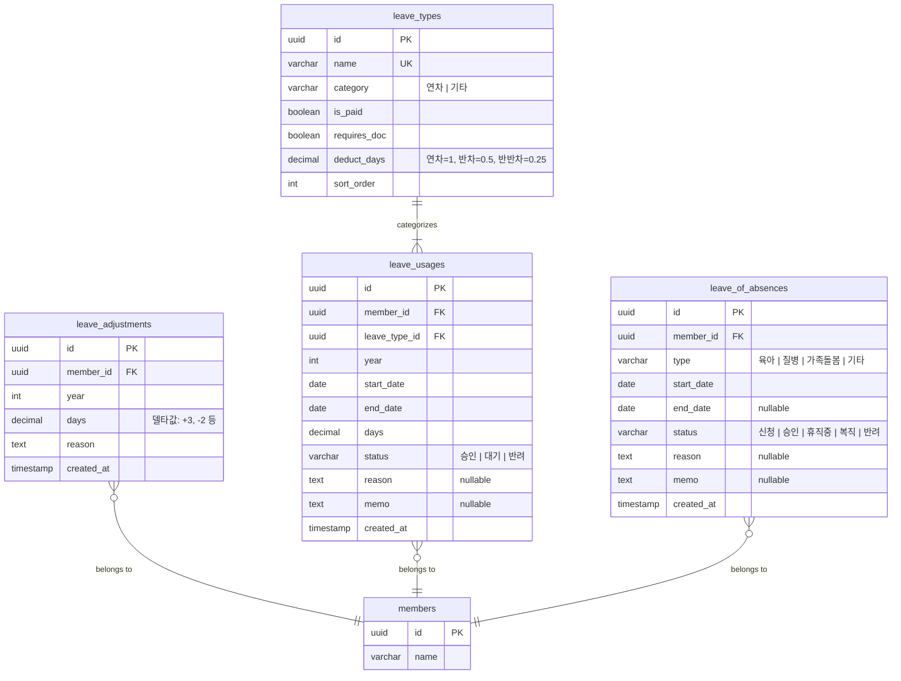

# 연차/휴가 스키마

```mermaid
erDiagram
    members {
        uuid id PK
        varchar name
    }

    leave_types {
        uuid id PK
        varchar name UK
        varchar category "연차 | 기타"
        boolean is_paid
        boolean requires_doc
        decimal deduct_days "연차=1, 반차=0.5, 반반차=0.25"
        int sort_order
    }

    leave_adjustments {
        uuid id PK
        uuid member_id FK
        int year
        decimal days "델타값: +3, -2 등"
        text reason
        timestamp created_at
    }

    leave_usages {
        uuid id PK
        uuid member_id FK
        uuid leave_type_id FK
        int year
        date start_date
        date end_date
        decimal days
        varchar status "승인 | 대기 | 반려"
        text reason "nullable"
        text memo "nullable"
        timestamp created_at
    }

    leave_of_absences {
        uuid id PK
        uuid member_id FK
        varchar type "육아 | 질병 | 가족돌봄 | 기타"
        date start_date
        date end_date "nullable"
        varchar status "신청 | 승인 | 휴직중 | 복직 | 반려"
        text reason "nullable"
        text memo "nullable"
        timestamp created_at
    }

    leave_types ||--|{ leave_usages : "categorizes"
    leave_adjustments }o--|| members : "belongs to"
    leave_usages }o--|| members : "belongs to"
    leave_of_absences }o--|| members : "belongs to"
```
