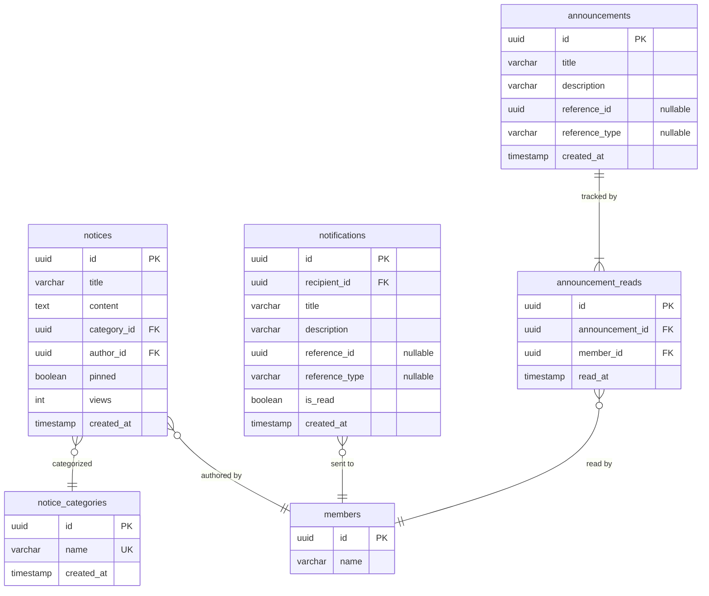

# 공지사항/알림 관리

## 공지사항 (Notice)

### 엔티티

- 제목, 내용
- 카테고리
- 작성자 (구성원)
- 고정 여부
- 조회수

### 비즈니스 규칙

- 관리자만 공지사항을 작성/수정/삭제할 수 있다
- 고정된 공지는 목록 상단에 표시된다
- 공지 등록 시 전체 알림이 발송된다

## 공지 카테고리 (Notice Category)

### 엔티티

- 이름 (고유)

### 비즈니스 규칙

- 관리자만 카테고리를 생성/수정/삭제할 수 있다

## 알림 체계

### 개인 알림 (Notification)

- 받는 사람 (구성원)
- 제목, 설명
- 참조 대상 (결재 요청 등)
- 읽음 여부

### 전체 알림 (Announcement)

- 제목, 설명
- 참조 대상 (공지사항 등)
- 읽음 추적: 어떤 구성원이 읽었는지만 기록

### Inbox 통합 조회

- 4개 탭: 전체 | 결재 | 내 신청 | 알림
- 개인 알림 + 전체 알림을 통합하여 표시한다

## 스키마

